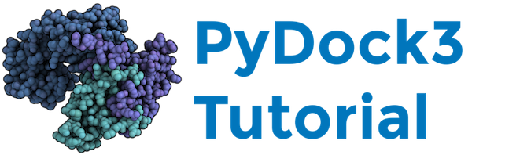

## 1. INTRODUCTION

In this practice you will learn how to use PyDock [1] to perform docking on a real case from CAPRI experiment [2], target 26 [3]. You will rank 100 docking solutions using pyDock energy, apply experimental data restraints and perform interface prediction based on desolvation energy (Optimal Docking Area [4]) to characterize different properties of the complex. Then, you will have to make your choice and select what you consider to be the best model from our starting pool of docking poses. Finally, RMSD comparison with the real 3-D complex structure will be done to check the results of our *“simulated CAPRI experiment”*.

### 1.1. Download data

Before continuing, clone the data files from this repository in your machine (you will need to install *git* beforehand):

```bash
git clone https://github.com/brianjimenez/pydock_tutorial.git
```

### 1.2. PyDock

We will use here the version 3.0 of pyDock that is already installed in your machine. Test the following in a terminal:

```bash
pydock3
```

If you see an output like this, pyDock is correctly installed:

```bash
PyDock3
  A set of tools for protein-protein docking
  Version 3.5.1

[pyDock3] ERROR: wrong parameters
Usage: pyDock3 dock_name module_name [options]
  pyDock available modules are :
  setup, zdock, ftdock, rotzdock, rotzdock3.0.2, rotftdock, rotftdock2.1, rotref, rotpatchdock, dockser, bindEy, docktet, dockrst
  RMSD, oda, patch, opra, makePDB, makePDBftdock, sipper, show, capriRMSD, randomspin, saxs, resEnergy, dockserContact, dnascore

pyDock3 terminated with error
```

For other installations, you can find further details and instructions in this [web site](https://life.bsc.es/pid/pydock/).


### 1.3. PyDock general syntax

All pyDock jobs are launched as follows:

```bash
pyDock3 dockname module
```

In our example, *dockname* is arbitrarily chosen by the user. In this example, we will use **T26** as *dockname*. The different modules that can be used in pyDock are listed here:

#### Docking:

|    Module        |        Input files       |      Output files                             |
| ---------------- |:------------------------:| :--------------------------------------------:|
|   setup          |      dockname.ini        | dockname\_rec.pdb<br>dockname\_lig.pdb          |
|   ftdock         |      dockname\_rec.pdb<br>dockname\_lig.pdb        | dockname.ftdock       |
|   zdock          |      dockname\_rec.pdb<br>dockname\_lig.pdb        | dockname.zdock        |
|   rotftdock      |      dockname.ftdock       |  dockname.rot  |
|   rotzdock       |      dockname.zdock       |  dockname.rot  |
|   dockser        |      dockname\_rec.pdb<br>dockname\_lig.pdb<br>dockname\_rec.pdb.H<br>dockname\_rec.pdb.H<br>dockname\_rec.pdb.amber<br>dockname\_rec.pdb.amber<br>      |  dockname.ene  |

#### Additional tools:

|    Module        |        Input files       |      Output files                             |
| ---------------- |:------------------------:| :--------------------------------------------:|
|   dockrst          |      dockname.ini<br>dockname\_rec.pdb<br>dockname\_lig.pdb<br>dockname\_rec.pdb.H<br>dockname\_rec.pdb.H<br>dockname\_rec.pdb.amber<br>dockname.rot<br>dockname.ene      | dockname.eneRST<br>dockname.rst          |
|   patch         |dockname\_rec.pdb<br>dockname\_lig.pdb<br>dockname\_rec.pdb.H<br>dockname\_rec.pdb.H<br>dockname\_rec.pdb.amber<br>dockname.rot<br>dockname.ene      | dockname.recNIP<br>dockname\_rec.pdb.nip<br>dockname\_lig.pdb.nip<br>dockname.ligNIP|
|   oda          | X.pdb<br>Y.pdb      | dockname\_rec.pdb.oda<br>dockname\_rec.oda.ODATAB<br>dockname\_lig.pdb.oda<br>dockname\_lig.oda.ODATAB|


## 2. DOCKING CALCULATIONS

### 2.1. Setup process

The first step before any docking calculation is to generate the pdb files that pyDock will use for docking.

At this point, you must define a receptor and a ligand in your complex. In general, the largest molecule is defined as the receptor and will be kept static, whereas the ligand will be rotated and translated around it.

To begin, you must have in your starting directory:

* [practical/1C5K.pdb](practical/1C5K.pdb)  (TolB or the receptor protein)
* [practical/1OAP.pdb](practical/1OAP.pdb)  (Pal or the ligand protein)

**NOTE: You will find these files at your working directory after `git clone` command.**


In addition, you need an *".ini"* file, which contains the information about the chains to dock from each pdb file, in order to create a new pair of parsed pdb files suitable for pyDock.

Thus, you have to create a text file called **T26.ini** in the `practical` folder and edit it to contain the following (incomplete) information:

```
[receptor]
pdb     = 1C5K.pdb
mol     = A
newmol  = A

[ligand]
pdb     = ?????
mol     = ?????
newmol  = ?????
```

Now we need to complete the *".ini"* file and replace the ***?????*** parts. The `mol` chain name is the original chain name in the input pdb files whereas the `newmol` will be the new chain name in the parsed pdb files suitable for pyDock. 

**Note:** The `newmol` chain names must be different for the receptor and the ligand (so that you can distinguish the chains when docked).

The pdb names in the *“.ini”* file must correspond to the exact names of the pdb files you have in the practical folder (1C5K.pdb, 1c5k.pdb, pdb1c5k.ent.Z, etc...).

#### Remarks:

> * If a pdb does not contain any chain name, use *“-”* in the `mol` field of your *.ini* file.
> * If it contains several copies of the same protein, select only one copy by its chain name.
> * If a protein to dock contains several chains (for example `L` and `H` chains for antibodies) that are relevant for docking, choose different `newmol` names separated by commas.

<br>
Once you have a complete `T26.ini` file, run the pyDock setup writing the following line in your console:

```bash
pydock3 T26 setup
```

This command will create the new PDB files for receptor and ligand:

* T26\_rec.pdb
* T26\_rec.pdb.H (containing hydrogens)
* T26\_rec.pdb.amber (AMBER parameters for each atom in the PDB structure)
* T26\_lig.pdb
* T26\_lig.pdb.H
* T26\_lig.pdb.amber

These files will be suitable for pyDock.


### 2.2. Sampling using Fast Fourier Transform (FFT) methods

PyDock can be applied to score rigid-body docking orientations generated by a variety of methods. 

We use ZDOCK or FTDock (both are FFT-based methods) to generate docking positions from T26_rec.pdb and T26_lig.pdb files.

Usually, we will use the `ftdock` or `zdock` modules to run the sampling using FTDock or ZDOCK software:

```bash
pydock3 T26 ftdock
```

or

```bash
pydock3 T26 zdock
```

But in this practical we will skip this step as it may require a long time to compute (from several minutes to hours depending on the CPU cores available).

So now choose between using the results from ZDOCK or FTDock and copy the need files to your `practical` folder.

#### Using FTDock results

```
cd practical
cp ../T26/dockings/ftdock/T26.ftdock .
```

#### Using ZDOCK results

```
cd practical
cp ../T26/dockings/zdock/T26.zdock .
```

#### 2.2.1. From FFT to Rot

Then, for each conformation, we need to transform the output data from ZDOCK (T26.zdock) and FTDock (T26.ftdock) (in which each solution is represented by the cartesian position of ligand and the rotation based on Euler angles) to the rotation and translation matrix that transforms the original ligand into the conformations generated by FTDock or ZDOCK. 

This is done by using the following command for ZDOCK:

```bash
pydock3 T26 rotzdock
```

or this one for FTDock:

```bash
pydock3 T26 rotftdock
```

This calculation is quite fast and it will create a T26.rot file containing the transformation matrices above mentioned for all docking poses. 

**IMPORTANT: Because of time limitations, in this practical we will only proceed with a subset of docking solutions. For that, you need to edit the T26.rot file to keep just 100 conformations (you may choose randomly 100 lines from the file).**

Before editing T26.rot file, make a copy of the original T26.rot file to save the entire set of docking solutions:

```bash
cp T26.rot T26.rot.orig
```

**Tip:** you can select *N* lines from a file using `sed`:

```bash
sed -n -e '11,110p' T26.rot.orig > T26.rot
```

### 2.3. Scoring using the pyDock energy function

Next stage is to use pyDock energy function to score and rank all positions by running dockser module with the following command:

```bash
pydock3 T26 dockser  > dockser.log  &
```

**WARNING: Be sure you created a T26.rot file with just 100 conformations, otherwise this step would last several hours.**

When dockser finishes, take a look to the output file called `T26.ene` that will look like the following example, with different values:

```
      Conf(1)     Ele(2)     Desolv (3)   VDW(4)     Total(5)        RANK(6)
----------------------------------------------------------------------------------
        8726     -28.979      -9.712     130.111      -38.691             1
        4538     -28.001      -8.980      38.482      -36.981             2
        6446     -29.716      -4.215      96.438      -33.931             3
        1590     -32.394       0.109      28.699      -32.285             4

```

* (1)	**Conf:** conformation number of the docking pose (same as that in the rot file, last column)
* (2)	**Ele:** Electrostatic energy component
* (3)	**Delsov:** Desolvation energy component
* (4)	**VDW:** Van der Waals energy component (term weighted to 0.1 by default)
* (5)	**Total:** Total binding energy (Ele + Desolv + 0.1*VDW)
* (6)	**RANK:** conformation rank according to its computed binding energy


## 3. ADDITIONAL PREDICTIVE TOOLS

### 3.1. Data-based distance restraints to orient docking

In order to help you in choosing the best models from the starting pool of solutions, you can complement pyDock energy-based ranking with distance restraints derived from experimental data. You can find the information from mutational analysis experiments as described in the following "Experimental data available” section. From there, you can select the residues you think might be located at the interface, and use them as distance restraints as we did in the real CAPRI competition.


> **Experimental data available [5]:**
> 
> **Ray MC, Germon P, Vianney A, Portalier R, Lazzaroni JC (2000) Identification by genetic suppression of Escherichia coli TolB residues important for TolB-Pal interaction. J Bacteriol 2000; 182: 821-824.**
> 
> “(...) The Tol-Pal system of Escherichia coli is involved in maintaining outer membrane stability acting as a barrier to the entry of macromolecules into the bacteria, thus providing protection against deleterious actions of bacteriocins and digestive enzymes. The periplasmic protein TolB was shown to interact with the outer membrane, peptidoglycan-associated proteins OmpA, Lpp, and Pal. Thus, TolB and Pal could be part of a multicomponent system linking the outer membrane to peptidoglycan.
The aim of this study was to determine the regions of TolB involved in the interaction of the protein with Pal. To this end, we used suppressor genetic techniques which had previously allowed us to characterize the regions of interaction between TolQ, TolR, and TolA. pal point mutations were identified, and some of them involved residues important for interaction with TolB. These mutations induce sensitivity to sodium cholate and release of periplasmic proteins in the medium. We used these pal mutants to search for suppressors in tolB.

> (...)
**Isolation of extragenic suppressor mutations of pal A88V in tolB.**
> Twelve mutations affecting 11 different residues of tolB were isolated as suppressor mutations of pal A88V (Table 2). They enabled the pal A88V mutant to grow on plates containing sodium cholate and lowered its excretion of periplasmic enzymes, some mutants being more efficient than others in suppressing the pal A88V phenotype. In most cases, the tolB mutations could not suppress the phenotypes of tolerance to colicins A and E2 of mutant pal A88V. Three tolB point mutations (H246Y, A249V, and T292I) affected the activity of TolB, whereas the others had phenotypes similar to the wild type.
All the extragenic suppressor mutations of pal A88V are located in the C-terminal region of TolB. This suggests that this region of TolB is important for its interaction with Pal.

> (...)
**Isolation of intragenic suppressor mutations of pal A88V.** 
> Mutations pal S99F and pal E102K were both isolated as intragenic suppressor mutations of pal A88V. The pal E102K mutation was previously described as a pal-defective mutant (7). Both pal S99F and pal E102K mutations enabled the pal A88V mutant to grow in the presence of sodium cholate and lowered its excretion of periplasmic enzymes, mutant pal E102K being more efficient than mutant pal S99F as a suppressor mutation (Table 1). Thus, the conformation of the region from residues 88 to 102 appeared to be important for Pal function.(...)”


Experimental data restraints must be included on a new line of the `*.ini` file as for example:

```
restr      = A.Arg.36
```

The `restr` keyword indicates to pyDock that distance restraint(s) will be used.

The restraint residue is defined by its chain name, its 3 letter amino-acid code (first letter in uppercase), and its number, as found in the molecule file used in docking.

When more than one restraint residues are used, they must be separated by comas with no space, as in the following example:

```
[receptor]
pdb     = 1C5K.pdb
mol     = A
newmol  = A
restr   = A.Hid.147,A.Arg.36

[ligand]
pdb     = 1OAP.pdb
mol     = A
newmol  = B
restr   = B.Phe.52
```

Be careful, **this example is only indicative to understand how restraint(s) must be included before running the pyDockRST module**. You have to include in the `T26.ini` file the experimental restraint(s) of your choice .

To run the corresponding module, type:

```bash
pydock3 T26 dockrst > dockrst.log &
```

This run should last several minutes. Once you have your `T26.eneRST` and `T26.rst` files, take a look at them and check how the experimental restraints affected the ranking of the original docking poses. The `T26.eneRST` file is the original `T26.ene` energy file combined with the restraint-based energy and ranked according to this new score.

#### Remarks:

A distance restraint defined from a given putative interface residue is considered satisfied when the center of coordinates of its side-chain lies within a distance of 6 Å from any non-hydrogen atom of the partner molecule.

For each docking solution, the percentage of satisfied restraints is converted to pseudo-energy (just by multiplying by -1.0) and added to the final scoring function in the `*.eneRST` file.


### 3.2. Interface prediction from docking results

We can use docking results for interface prediction with the `patch` module. 

This tool gives an idea about the binding interface localization considering the top 100-solutions in pyDock ranking. Of course, **this module is relevant when one is working with thousands of different poses as it reflects the convergence of the top-100 solutions based on their energies**. 

Here, we will use it on our 100 solutions pool to determine if our poses converged around what we will consider the correct interface determined by the *Ray et al.* mutational experimental data.

Use the following line to run the `patch` module that will last only several minutes:

```bash
pydock3 T26 patch
```

Take a look to the output files. The `T26.ligNIP` and `T26.recNIP` files contain the list of ligand and receptor residues with their corresponding *NIP* (Normalized Interface Propensity) values. 

The `T26_rec.pdb.nip` and `T26_lig.pdb.nip` files are pdb files in which the B-factor column is replaced by the NIP values, so that the results can be easily visualize with most of molecular graphic programs.


#### Remarks:

* The NIP (Normalized Interface Propensity) value represents the frequency of a given residue to be located at the interface among the 100 lowest-energy solutions of docking.

* If NIP = 0, the corresponding residue appears at the interface within the top 100 docking poses as expected by a random distribution.
	
* If NIP < 0, the corresponding residue appears at the interface within the top 100 docking poses less than expected by random.

* If NIP > 0.2, the corresponding residue is predicted to be at the interface as it appears significantly more often than expected by random.


#### 3.2.1. Visualizing *patch* results

**NOTE: Depending on Pymol version, files ending in `.nip` might not be opened. Just switch `.nip` extension for `.pdb` instead to avoid this problem.**

You can visualize `patch` module results (stored in the B-factor column) in PyMol:

```bash
PyMOL> load T26_rec.pdb.nip
PyMOL> spectrum b, blue_white_red, minimum=0.0, maximum=0.2
```

Residues with NIP values ≤ 0.0 will appear in blue whereas NIP values ≥ 0.2 will be in red.

You can do the same with the ligand molecule:

```bash
PyMOL> load T26_lig.pdb.nip
PyMOL> spectrum b, blue_white_red, minimum=0.0, maximum=0.2
```

You can also sort the `T26.recNIP` and `T26.ligNIP` files according to the NIP column and compare the predicted residues (NIP ≥ 0.2) localization with *Ray et al.* mutational data.

Now you can analyze your residues of interest: If you highlight (e.g. display as spheres) the residues known to be involved in complex formation by mutational experiments (e.g. the ones you selected as restraint residues), you can visually compare them with the location of the NIP-based interface predicted residues (in red).

As an example, the following command line highlights H147 and R36 of TolB (receptor):

```bash
PyMOL> show spheres, /T26_rec.pdb.nip///147+36
```

Then, another example, shows F52 in Pal (ligand):

```bash
PyMOL> show spheres, /T26_lig.pdb.nip///52
```

**WARNING: These residues are shown here just as an example, you will need to indicate your own residues.**


### 3.3. Optimal Docking Area (ODA) analysis or Interface prediction from protein surface desolvation energy

We can analyze the optimal desolvation patch on a protein surface to predict potential binding interface sites with the *ODA* method [4].

This can be useful complementary information in any docking problem. However, in this CAPRI example, given that in our case, *Pal* and *TolB* proteins are part of a much bigger multi-protein complex, the existence of more than one binding region on each of these proteins is more than probable. Consequently, ODA results must be taken carefully as predicted residue(s) may belong to any existing binding interfaces of both proteins.

Run the ODA module for the TolB protein as follows:

```bash
pydock3 1C5K.pdb oda
```

and then, once you obtain your 1C5K output files, you can run ODA for the Pal protein:

```bash
pydock3 1OAP.pdb oda
```

We will use PyMol to color each residue of the TolB protein according to its ODA calculated value in a gradient from red (ODA values ≤ -10.0) to blue (ODA values ≥ 0.0).

```bash
PyMOL> load 1C5K.pdb.oda
PyMOL> spectrum b, red_white_blue, minimum=-10.0, maximum=0.0
```

Repeat the same process with the Pal protein:

```bash
PyMOL> load 1OAP.pdb.oda
PyMOL> spectrum b, red_white_blue, minimum=-10.0, maximum=0.0
```

## 4. ANALYSIS OF CAPRI RESULTS

### 4.1. Comparison with the real 3D complex structure

Now, you can tell us which is the conformation number you consider to be the best model taking into account pyDock energy ranking (VDW energy included or not), the applied experimental restraints of your choice, ODA predictions, etc...

You can compare the RMSD between your proposed model and the real 3D complex structure (PDB [2HQS](https://www.rcsb.org/structure/2HQS)).

First, you have to generate the pdb file of your favorite conformation (or range of conformations) using the module `makePDB` as follows:

```bash
pydock3 T26 makePDB 1 3
```

(this will create pdb files for the docking poses ranked from 1 to 3; replace these numbers by the ones of your favourite docking poses as ranked in the `*.ene` file, RANK column).

#### Remarks:

The `makePDB` module needs 3 arguments:

```bash
pydock3 dockname makePDB rank1 rank2
```

which in our example are:

* **dockname:** T26
* **rank1:** the conformation number you are interested in generating the PDB file, as ranked in the `*.ene` file 
* **rank2:** the same as rank1 for a single conformation. You may also generate PDB files for a range of conformations (from rank1 to rank2 numbers).

#### Visualizing with Pymol:

Now check that your pdb files appeared. They will be called as `T26_XXX.pdb`, where `XXX` is the conformation number as in the `T26.ene` file (*Conf* column).

You can visually compare the docking models with the complex structure, using PyMol:

```bash
PyMOL> load 2hqs.pdb
PyMOL> load T26_XXX.pdb
PyMOL> hide
PyMOL> show cartoon, /2hqs//A+H
PyMOL> color green
PyMOL> show cartoon, /T26_XXX
PyMOL> color red, /T26_XXX
PyMOL> align /T26_XXX//A, /2hqs//A
```

The complex structure (PDB code 2HQS) has several copies in the asymmetric unit. We will use as reference the complex formed by chains A and H. Check the differences (in terms of RMSD) in the ligand position between your docking models and the real crystallographic structure. You have already in the results folder the `T26_ref.pdb` reference structure created for your convenience.


Remarks on RMSD:

To facilitate the docking results analysis, the complex pdb (when it is available) can be used as reference in the `.ini` file to compute automatically the RMSD between the real ligand position and the one it adopts in each docking conformation.

The reference is included in the `.ini` file as follows:

```
[receptor]
pdb     = REC.pdb
mol     = A
newmol  = A

[ligand]
pdb     = LIG.pdb
mol     = C
newmol  = B
	
[reference]
pdb     = REF.pdb
recmol  = L
ligmol  = I
newrecmol  = A
newligmol  = B
```

The `newrecmol` must be the same chain name as `newmol` for the receptor, and the `newligmol` must be the same as `newmol` for the ligand.

Using `setup` with this `.ini` file will generate a `dockname_ref.pdb`, and dockser will show the RMSD values in the `*.ene` file (`RMSD` and `intRMSD` new columns, which correspond to the *ligand RMSD* and the *interface RMSD* respectively.


## 5. IDEAS FOR DISCUSSION

- Compare the results of pyDock scoring with the original FTDock or ZDOCK scoring. Do you find any change in the number of near-native solutions within the top 10 scored models? Has the best near-native rank improved after pyDock scoring?

- Do restraints help to improve the results? (hint: compare RMSD and find best near-native rank for docking models before and after applying restraints)

- Is NIP-based `patch` prediction located at the real interface?

- Are ODA predicted residues located at the real interface?

- Based on this case, do you think NIP or ODA could be useful to identify real protein-protein interfaces in a real case?


## 6. REFERENCES

[1] *Cheng TM, Blundell TL, Fernández-Recio J.* (2007) **pyDock: electrostatics and desolvation for effective scoring of rigid-body protein-protein docking.** *Proteins*. 68, 503-15.

[2] *Janin J, Henrick K, Moult J, Eyck LT, Sternberg MJE, Vajda S, Vakser I, Wodak SJ.* (2003) **CAPRI: A Critical Assessment of PRedicted Interactions Proteins**. *Proteins*. 52, 2-9.

[3] *Grosdidier S, Pons C, Solernou A, Fernández-Recio J*. (2007) **Prediction and scoring of docking poses with pyDock**. *Proteins* 69, 852-858.

[4] *Fernández-Recio J, Totrov M, Skorodumov C, Abagyan R.* (2005) **Optimal docking area: a new method for predicting protein-protein interaction sites**. *Proteins* 58, 134-143.

[5] *Ray MC, Germon P, Vianney A, Portalier R, Lazzaroni JC.* (2000) **Identification by genetic suppression of Escherichia coli TolB residues important for TolB-Pal interaction**. *J Bacteriol*. 182, 821-824.

[6] *Fernández-Recio J, Totrov M, Abagyan R.* (2004) **Identification of protein-protein interaction sites from docking energy landscapes**. *J Mol Biol*. 335, 843-65.

[7] *Grosdidier S,  Fernández-Recio J*. (2008) **Identification of hot-spot residues in protein-protein interactions by computational docking**. *BMC Bioinformatics* 9, 447.
